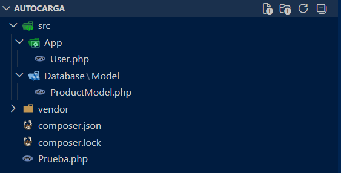
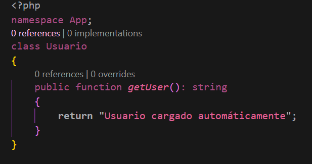
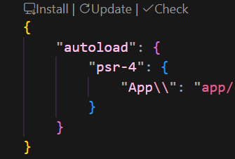
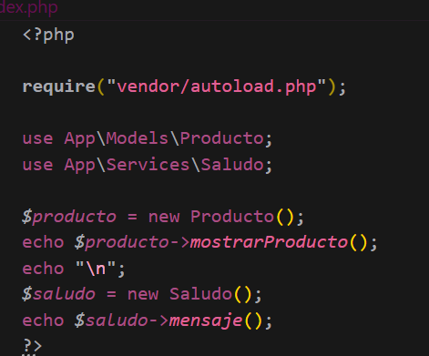

# Laboratorio: Implementación de Autocarga PSR-4 con Composer

Este repositorio contiene la documentación y estructura práctica para la implementación del estándar **PSR-4** utilizando el sistema de autocarga (*Autoload*) de **Composer** en PHP, eliminando por completo el uso manual de sentencias `require` e `include`.

---

## Información del Estudiante
* **Nombre:** Estrella Pino
* **Cédula:** 8-1031-1486
* **Curso:** Desarrollo de Software 7
* **Fecha de Ejecución:** 01-05-2026
* **Instructor de Laboratorio:** Irina Fong

---

## 📝 Introducción
El estándar **PSR-4** define una especificación formal para la carga automatizada de clases a través de un mapeo directo entre los espacios de nombres (*namespaces*) y la estructura de directorios del sistema de archivos.

El objetivo principal de este laboratorio es sustituir el flujo tradicional de importación manual por una solución automatizada, limpia, escalable y transparente bajo el principio de *Lazy Loading*.

---

## 📁 Estructura del Proyecto

La correspondencia entre la jerarquía de carpetas y los namespaces es estricta (case-sensitive) según lo dictado por la norma de interoperabilidad de PHP:

Flujo de Trabajo — Paso a Paso
Paso 1 — Inicialización del Proyecto y Directorios
Se creó la carpeta raíz Autocarga/ y los subdirectorios bajo src/. La regla de negocio es directa: si una clase va a pertenecer al namespace Database\Model, debe residir físicamente en el directorio src/Database/Model/.

Paso 2 — Creación de las Clases PHP
Cada archivo de clase declara su espacio de nombres en la primera línea de código inmediatamente después de la apertura de la etiqueta <?php.

Ejemplo de definición (src/Database/Model/Usuario.php):

PHP
<?php
namespace Database\Model;

💡 Nota de eficiencia: Realizar la impresión sin el uso de Composer daría el mismo resultado visual, pero ralentiza drásticamente el desarrollo al obligar a escribir un require individual por cada clase nueva.

Paso 3 — Configuración del Archivo composer.json
Se inicializó el archivo de configuración en la raíz del proyecto para definir las reglas de mapeo PSR-4:

Este bloque le indica de manera explícita a Composer los puntos de partida de resolución:

El namespace raíz App\ buscará elementos dentro de src/App/.

Paso 4 — Ejecución de composer install
Para procesar la configuración y compilar el mapa de clases, se ejecuta el siguiente comando en la terminal:

Bash
composer install
Este comando genera la carpeta vendor/, la cual administra de forma automatizada las dependencias del proyecto y, fundamentalmente, el script autogenerado vendor/autoload.php.

Paso 5 — Pruebas de Integración con Prueba.php
Se implementó un archivo de prueba en la raíz del proyecto. Al incluir el cargador de Composer, se reemplazan las sentencias de carga física tradicionales por el operador lógico use.

⚠️ Aclaración técnica: La sentencia use no realiza la carga del archivo en disco; simplemente define un alias corto dentro del ámbito actual del script. El trabajo pesado de localización e inclusión lo realiza vendor/autoload.php bajo demanda únicamente cuando la clase es instanciada.

Paso 6 — Configuración de .gitignore
Antes de realizar el commit y subida al repositorio remoto, se creó un archivo .gitignore para excluir la carpeta de dependencias:

Plaintext
/vendor/
Finalidad: Demostrar la portabilidad del estándar. Al clonar un repositorio limpio que carece de la carpeta vendor/, basta con ejecutar composer install en la terminal para reconstruir el entorno por completo de manera inmediata y exacta.

Conclusiones Técnicas
Mantenibilidad y Escalabilidad: El desarrollo se vuelve modular. Agregar nuevas clases no requiere alterar configuraciones globales ni listados de dependencias manuales; el ecosistema de Composer resuelve el mapeo en tiempo de ejecución de manera transparente.

Optimización de Memoria (Lazy Loading): Composer sólo procesa e incluye en memoria las clases que efectivamente son instanciadas durante el ciclo de vida del script actual. En entornos con cientos de clases donde solo se requiere un subconjunto mínimo, las clases restantes jamás son consumidas en disco, reduciendo la carga en memoria RAM.